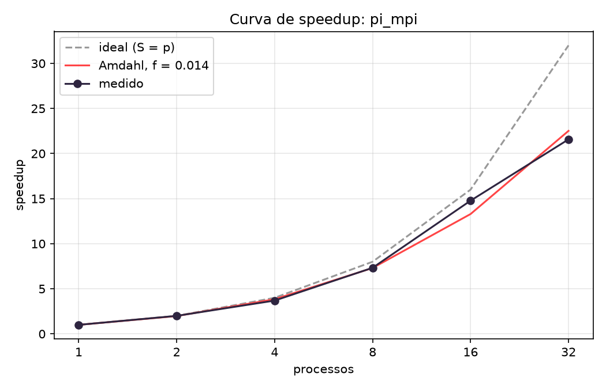

# Análise Individual: Escalabilidade de Pipeline Dask vs. Aplicação MPI

**Projeto:** Processamento de PLN sobre Corpus Amazon Polarity vs. Cálculo de $\pi$ via MPI (`pi_mpi`)  
**Ambiente:** Cluster OpenHPC (1 Master + 4 Nós de Processamento, Intel Core i3-13100T, 16 cores físicos, 32 CPUs lógicas, Rede Gigabit)  
**Estatísticas Utilizadas:** Mediana de 3 rodadas para o pipeline em Dask; menor tempo de 2 rodadas para o `pi_mpi`

---

## 1. Visão Geral e Curvas de Speedup

A avaliação comparativa de desempenho reflete os tempos de execução medidos na infraestrutura do cluster. A curva ideal linear ($S(p) = p$) serve como referência de escalabilidade perfeita.

### Gráficos de Desempenho

*Figura 1: Curva de speedup obtida para a execução do `pi_mpi`.*

*Figura 2: Comparação entre o speedup do corpus TF-IDF em Dask, o `pi_mpi` e a reta ideal linear.*

### Tabela Comparativa de Desempenho

| Workers ($p$) | Nós | Corpus $t_{total}$ (s) | Speedup Corpus | Eficiência Corpus | Speedup `pi_mpi` | Eficiência `pi_mpi` |
|---|---|---|---|---|---|---|
| 1 | 1 | 27,34 | 1,00 | 100% | 1,00 | 100% |
| 2 | 1 | 47,16 | 0,58 | 29% | 1,99 | 100% |
| 4 | 1 | 37,75 | 0,72 | 18% | 3,69 | 92% |
| 8 | 2 | 33,58 | 0,81 | 10% | 7,33 | 92% |
| 16 | 4 | 26,98 | 1,01 | 6% | 14,78 | 92% |
| 32 | 4 | 22,51 | 1,21 | 4% | 21,57 | 67% |

*Tabela estruturada com base nos dados consolidados do grupo.*

### Comportamento das Curvas
* **`pi_mpi` (MPI em C):** Mantém escalabilidade quase linear até 16 processos (eficiência de 92% e speedup de 14,78×). Atinge o pico de 21,57× com 32 processos. Trata-se de uma aplicação intensiva em CPU sem dependência crítica de I/O de disco ou troca massiva de dados intermediários.
* **Corpus TF-IDF (Dask em Python):** Apresenta regressão de desempenho de 2 a 8 workers, com speedup inferior a 1,00× ($S(2) = 0,58$, $S(4) = 0,72$, $S(8) = 0,81$). Com 32 workers, o speedup máximo obtido restringe-se a 1,21×, operando com eficiência paralela de 4%.

---

## 2. Análise Detalhada dos Gargalos

### 2.1 I/O no Network File System (NFS)
A operação de leitura no NFS não escala com o aumento de workers, mantendo flutuação entre 1,67 s e 4,56 s.
* **Causa Física:** Todos os workers requisitam partes do mesmo arquivo na imagem exportada pelo nó master via NFS Gigabit. O estrangulamento localiza-se na interface de rede do master e nas rotinas centralizadas de E/S.
* **Impacto na Inicialização:** O tempo de subida do cluster (`t_sobe`), medido separadamente de $t_{total}$, salta de 2,93 s em 1 nó para 36,94 s em 4 nós, decorrente do carregamento simultâneo do interpretador e dependências via rede.

### 2.2 Shuffle e Serialização Interprocessos (Gargalo Dominante)
O fator determinante para o achatamento da curva do pipeline Dask é a movimentação e reconstrução de estruturas de dados pesadas entre processos.
* **Provação Numérica:** Na transição de 1 para 2 workers executados no mesmo nó físico, a etapa `df` sobe de 7,31 s para 16,33 s e a etapa `stats` passa de 7,35 s para 23,01 s. As etapas largas somam 14,66 s com 1 worker (53,6% do total) e chegam a ultrapassar 80% do tempo total com múltiplos workers.
* **Mecanismo:** Com 1 worker, os dicionários de frequência (~196 mil termos) permanecem no espaço de memória local do processo. Com 2 ou mais workers, o Dask serializa esses dicionários via `pickle`/`cloudpickle`, transferindo-os via IPC/socket local para mesclagem, o que eleva exponencialmente o custo computacional de CPU.

### 2.3 Desempenho da Rede Gigabit
* **Rede Física:** Medições de latência e largura de banda por ping-pong indicaram 235,37 µs e throughput de 107,2 MB/s (~86% do limite teórico do padrão 1 Gbps).
* **Comportamento no Corpus:** A migração de 1 nó (4 workers, $t_{total} = 37,75\text{ s}$) para 2 nós (8 workers, $t_{total} = 33,58\text{ s}$) resulta em redução do tempo total. Isso confirma que a latência e a largura de banda do switch de 1 Gbps não constituem o estrangulamento primário, sendo este dominado pela serialização interna.

### 2.4 Hyperthreading (SMT) a partir de 16 Workers
O cluster conta com 16 núcleos físicos e 32 CPUs lógicas via SMT.
* **Análise:** No `pi_mpi`, a eficiência cai de 92% para 67% com 32 threads. No pipeline Dask, embora o tempo total reduza ligeiramente de 26,98 s para 22,51 s, o tempo de cálculo estrito (`t_calc`) aumenta de 1,65 s para 2,01 s, evidenciando que threads lógicas concorrentes em Python geram disputa por cache e memória sem ganho real de paralelismo computacional.

---

## 3. Estimativa da Fração Serial e Ajuste de Modelos

A Lei de Amdahl define o limite teórico do speedup $S(p)$ com base na fração serial $f$:

$$S(p) = \frac{1}{f + \frac{1 - f}{p}}$$

### 3.1 Aplicação ao `pi_mpi`
* **Fração Serial Estimada:** $f \approx 0,0127$ ($1,27\%$).
* **Teto Teórico ($S_{\infty}$):** $\frac{1}{f} \approx 78,7\times$.
* **Acurácia:** Para $p = 32$, o modelo projeta $S(32) = 22,95$, enquanto o medido foi $21,57$. A diferença decorre da menor eficiência computacional das threads SMT.

### 3.2 Degradação do Modelo no Pipeline Dask
1. **Falha do Ajuste Clássico:** Como $S(p) < 1,00$ nos pontos iniciais, a regressão linear de $\frac{1}{S(p)}$ produz intercepto truncado em $f = 1,00$ ($100\%$ serial).
2. **Estimativa por Decomposição Interna ($p = 1$):**
   $$f_{est} = \frac{t_{serial}}{t_{total}} = \frac{16,97}{27,34} \approx 0,62\ (62\%)$$
   Isso impõe um teto teórico de $S_{\infty} = \frac{1}{0,62} \approx 1,61\times$, aproximando-se do resultado obtido de $1,21\times$ com 32 workers.

### 3.3 Métrica de Karp-Flatt
A métrica de Karp-Flatt $e(p)$ avalia se a ineficiência deriva de código serial estrito ou de overheads variáveis:

$$e(p) = \frac{\frac{1}{S(p)} - \frac{1}{p}}{1 - \frac{1}{p}}$$

Valores empíricos calculados: $e(2) = 2,45$, $e(4) = 1,52$, $e(8) = 1,27$, $e(16) = 0,99$, $e(32) = 0,82$. O decréscimo contínuo de $e(p)$ comprova que o gargalo **não constitui uma fração serial fixa**, mas sim um **custo fixo elevado de inicialização de estado e serialização interprocessos** diluído com o aumento de workers.

---

## 4. Limitações da Análise
1. **Versão do Pipeline (v1):** Utiliza funções de agregação padrão do Dask sem otimização de redução combinada local.
2. **Baseline de Referência:** A medição com 1 worker inclui o overhead inerente ao agendador do framework Dask.
3. **Discrepância Estatística:** O `pi_mpi` emprega o menor tempo de 2 rodadas, enquanto o corpus utiliza a mediana de 3 rodadas.

---

## 5. Conclusão
O pipeline de TF-IDF em Dask escala de forma ineficiente no cluster, atingindo speedup máximo de $1,21\times$ com 32 workers contra $21,57\times$ do `pi_mpi`. O fator limitante principal restringe-se ao custo de **serialização e transferência de vocabulários** nas etapas de agregação, refutando a hipótese de saturação por I/O de rede ou disco. A degradação do modelo de Amdahl e o comportamento decrescente de Karp-Flatt corroboram que o overhead é dinâmico e inerente à arquitetura de paralelização de dados.