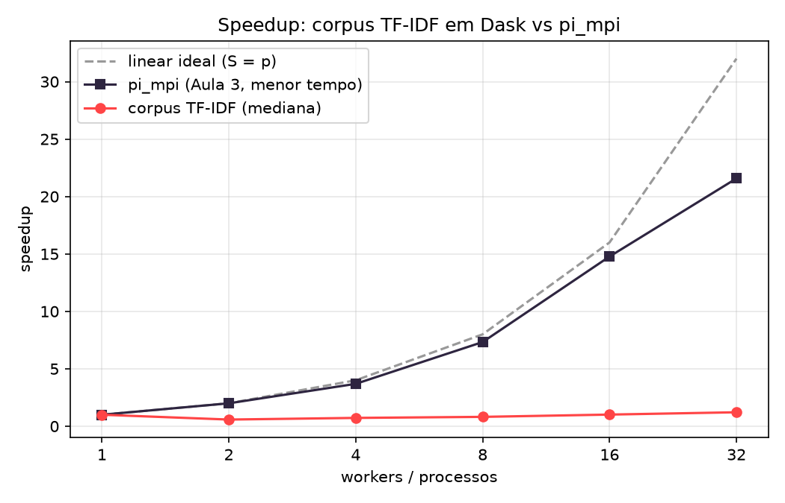

# Análise individual: Pedro Auler

HPC, Inteli 2026.2 (Prof. João Luisi). Atividade ponderada da Aula 5.
Os números são do grupo e estão em `../resultados/`. A interpretação abaixo é minha.

## 1. Resumo

- **Corpus:** 300.000 resenhas do Amazon Polarity, pipeline de PLN em Dask (tokenização, stopwords, TF-IDF e estatísticas), medido com 1, 2, 4, 8, 16 e 32 workers, 3 rodadas cada, mediana.
- **Resultado:** o speedup do corpus é **abaixo de 1 de 2 a 8 workers** (0,58; 0,72; 0,81) e chega a **1,21× com 32 workers**. O `pi_mpi` da Aula 3, no mesmo cluster, chega a **21,57×**.
- **Causa principal:** as etapas que escalam (tokenização, stopwords, TF, TF-IDF) são só 37% do tempo com 1 worker e caem para ~9% com 32. A parte que **não escala** (`t_serial`: leitura, DF e estatísticas) é 62% com 1 worker e passa de 85% com 2 ou mais workers. As duas etapas de agregação (`df` e `stats`), que movem dicionários de ~196 mil termos entre processos, **pioram** já ao sair de 1 para 2 workers no mesmo nó, o que aponta para **serialização** e não para a rede.
- **Fração serial:** `pi_mpi` f ≈ 1,3% (Amdahl, teto ~79×). Do pipeline, o ajuste de Amdahl **degenera** (f = 1, truncado), porque o speedup é menor que 1; as estimativas possíveis ficam entre f ≈ 0,62 e 0,89 (seção 5), com a ressalva de que o modelo de Amdahl não descreve bem esta curva.

## 2. O que foi feito

### Cluster
Master e 4 nós (c1 a c4), Rocky Linux 9.8, OpenHPC, Warewulf 4, SLURM 25.11.4. Cada nó tem um Intel Core i3-13100T (4 cores físicos, 2 threads por core, 8 CPUs lógicas) e 7.627 MB de RAM, com a imagem do sistema também na RAM (~4,1 GB livres). Total: **16 cores físicos, 32 CPUs lógicas**. Rede gigabit em switch isolado (ping-pong: 235 µs de ida e volta de 1 B entre nós; 107,2 MB/s com 1 MiB, ~86% do teórico).

### Parte 1: `pi_mpi`
Refiz a série em 30/09 com `speedup_2rodadas.sh`, com a **posição dos processos controlada** (1, 2 e 4 em 1 nó; 8 em 2 nós; 16 em 4 nós; 32 em 4 nós com SMT), 2 rodadas encadeadas, menor tempo por ponto. A série de 09/09 não foi usada: os processos não tinham posição controlada e os jobs rodaram ao mesmo tempo (o CSV estava sem cabeçalho e com as linhas fora de ordem, o que denuncia a execução simultânea).

### Parte 2: pipeline sobre o corpus
- **Etapas:** leitura → tokenização → stopwords → TF → **DF/IDF** (larga) → TF-IDF → estatísticas (tamanho do vocabulário, distribuição de tamanho dos documentos, termos de maior TF-IDF, definido como a soma do TF-IDF sobre os documentos). Cada etapa é cronometrada com `persist()` e `wait()`.
- **Decisões:** Dask (não Spark), porque as etapas são funções Python por documento e o ambiente validado em aula é o Dask; **4 workers de 1 thread por nó** (o GIL impede que threads processem texto em paralelo); 128 partições nas 6 configurações; scheduler dentro do job, no primeiro nó; painel só por túnel SSH.
- **Medição:** `t_total` conta depois do `wait_for_workers`; `t_calc` = etapas estreitas; `t_serial` = `t_total − t_calc`. A subida do cluster (`t_sobe`) é registrada à parte. Mediana de 3 rodadas por configuração.
- **Escolha do corpus:** comecei com o **AG News** (120.000 notícias), mas a calibração com 1 worker deu **11,9 s**, dos quais 53% já eram custo que não escala. Com esse tamanho os custos fixos dominariam a curva. Troquei, **antes da série e sem mudar depois**, para 300.000 resenhas do Amazon Polarity (**27,8 s** com 1 worker). Escolhi um subconjunto fixo (as primeiras 300.000) porque cada nó tem só ~4,1 GB livres. Não aumentei o corpus para "melhorar a curva" (isso seria Gustafson).

## 3. Resultados

### Speedup (mediana de 3 rodadas; `pi_mpi`: menor de 2 rodadas)

| workers | nós | corpus t_total (s) | corpus speedup | corpus efic. | `pi_mpi` speedup | `pi_mpi` efic. |
|---|---|---|---|---|---|---|
| 1 | 1 | 27,34 | 1,00 | 100% | 1,00 | 100% |
| 2 | 1 | 47,16 | 0,58 | 29% | 1,99 | 100% |
| 4 | 1 | 37,75 | 0,72 | 18% | 3,69 | 92% |
| 8 | 2 | 33,58 | 0,81 | 10% | 7,33 | 92% |
| 16 | 4 | 26,98 | 1,01 | 6% | 14,78 | 92% |
| 32 | 4 | 22,51 | 1,21 | 4% | 21,57 | 67% |

As três curvas (corpus, `pi_mpi` e linear ideal, eixo x em log₂) estão no gráfico. O `pi_mpi` acompanha a linear ideal até 16 e se afasta em 32; o corpus fica praticamente plano, perto de 1.

### Tempo por etapa (mediana, segundos)

| workers | leitura | tokeniza | stopwords | tf | **df** | tfidf | **stats** | subida do cluster |
|---|---|---|---|---|---|---|---|---|
| 1 | 2,25 | 4,72 | 2,31 | 1,72 | **7,31** | 1,48 | **7,35** | 2,93 |
| 2 | 1,72 | 2,52 | 1,19 | 1,28 | **16,33** | 0,94 | **23,01** | 2,47 |
| 4 | 1,67 | 1,52 | 1,01 | 0,74 | **12,57** | 0,78 | **19,42** | 2,89 |
| 8 | 2,71 | 1,24 | 0,62 | 0,67 | **10,90** | 0,72 | **16,18** | 32,90 |
| 16 | 4,56 | 0,37 | 0,22 | 0,32 | **7,73** | 0,72 | **12,22** | 36,94 |
| 32 | 2,13 | 0,30 | 0,20 | 0,21 | **7,11** | 1,31 | **11,18** | 32,30 |

Participação no `t_total`: `df` + `stats` = 54% (1 worker), 83%, 85%, 81%, 74% e 81% (32 workers). `t_calc` (etapas estreitas) = 37% com 1 worker e 6% a 13% depois.

Dispersão entre as 3 rodadas (máximo menos mínimo, sobre a mediana): 1% com 1 e 32 workers, 5% com 8, 10% com 4, 15% com 2 e 16% com 16 workers. As conclusões abaixo não dependem dessas diferenças, mas os pontos de 2 e 16 workers são os mais ruidosos.

## 4. Gargalos: onde aparecem na curva e que número prova

A distância entre as curvas vem de uma diferença de natureza. O `pi_mpi` não lê arquivo, não troca dados durante o cálculo e só faz um `Reduce` no fim (`t_serial` de milésimos de segundo). O pipeline lê do NFS, agrega um vocabulário inteiro e devolve resultados ao cliente. Para cada gargalo pedido:

### 4.1 I/O no NFS
- **Onde aparece:** a etapa de leitura **não diminui** com mais workers: 2,25 s (1), 1,72 (2), 1,67 (4), 2,71 (8), **4,56 (16)**, 2,13 (32). Com 16 workers ela vale 17% do `t_total`.
- **Número que prova:** os 83 MB do corpus custariam ~0,8 s no cabo gigabit do master (83 MB ÷ 107 MB/s medidos no ping-pong), e a leitura mede de 2 a 6 vezes isso. Ler não escala porque todos os leitores saem do mesmo master por um único cabo.
- **Peso na curva:** moderado (4% a 17% do total). Ele compõe a parte que não escala, mas **não é o gargalo dominante**.
- **Indício relacionado, ainda fora do `t_total`:** a subida do cluster leva ~3 s em 1 nó e **32 a 37 s** com 2 ou 4 nós (12 vezes mais). Os nós importam o Python e as bibliotecas do NFS. Não verifiquei a causa (pode ser cache frio dos nós novos); registro como observação.

### 4.2 Shuffle e serialização (o gargalo dominante)
- **Onde aparece:** nas etapas **largas**, `df` (contagem de documentos por termo) e `stats` (soma do TF-IDF por termo). Já com 1 worker elas somam 14,7 s (54% do tempo). Ao passar de **1 para 2 workers**, `df` sobe de 7,31 s para **16,33 s** e `stats` de 7,35 s para **23,01 s**, enquanto as etapas estreitas caem.
- **Número que prova a natureza do custo:** a piora acontece **dentro do mesmo nó** (1 e 2 workers em 1 nó), portanto **não é rede**. Com 1 worker, todos os dados ficam no mesmo processo e nada é serializado; com 2, os dicionários parciais (de dezenas de milhares de termos por partição, ~196 mil no total) precisam ser serializados e copiados entre processos.
- **Reforço:** ao cruzar de 1 para 2 nós (4 → 8 workers), `df` e `stats` **melhoram** (12,57 → 10,90 e 19,42 → 16,18), o que mostra que o custo dominante é a serialização e a agregação de dicionários grandes, e não o switch.
- **Uma segunda ocorrência:** o `tfidf` sobe de 0,72 s (16 workers) para 1,31 s (32). É o único ponto em que essa etapa piora, e é onde o dicionário de IDF é enviado a 32 workers. Hipótese (não medi o tamanho do dicionário): o custo de mover o IDF cresce com o número de workers.
- **Peso na curva:** é o que mais explica o achatamento. `df` + `stats` são 81% do tempo com 32 workers.

### 4.3 Rede gigabit
- **Medido:** latência de 235,37 µs e 107,2 MB/s (ping-pong, Parte 1). O `pi_mpi` mostra o custo: `t_serial` sobe de 0,000 s (1 nó) para 0,005 s (8), 0,009 s (16) e 0,008 s (32), o que é o `Reduce` atravessando o switch.
- **No corpus:** não há evidência de que a rede seja o limite neste volume: ao passar de 1 para 2 nós o tempo total **melhora** (37,75 → 33,58 s). Também não medi o tráfego no switch, então não afirmo que seja desprezível em outro tamanho de corpus, onde o shuffle moveria mais dados. Só o `tfidf` a 32 workers (item acima) sugere efeito de transferência.

### 4.4 Hyperthreading a partir de 16 workers
- **`pi_mpi`:** eficiência de 92% até 16 e **67% em 32**; ganho de 16 para 32 de apenas **1,46×** (o ideal seria 2×). Cada nó tem 4 cores × 2 threads: com 32, dois processos dividem o mesmo core.
- **Corpus:** o speedup vai de 1,01 (16) para 1,21 (32), ganho de 1,20×. O `t_calc` **sobe** de 1,65 s para 2,01 s, e o speedup do `t_calc` cai de 6,2 para 5,1 (`tfidf` 0,72 → 1,31 s). Portanto, o SMT rende pouco também para o texto (Python, com muito acesso à memória). O ganho de ~4,5 s de 16 para 32 workers vem sobretudo da leitura (cerca de −2,4 s; com 16 workers ela estava alta, 4,56 s) e das etapas largas (cerca de −1,7 s); as etapas estreitas até pioraram (+0,4 s). Ou seja, não é o SMT dando mais cores úteis.
- **Outro fator a considerar:** com 4 workers no mesmo nó, o scheduler e o cliente ficam no primeiro nó e competem com os workers por cores. Não separei essa contribuição do SMT.

### 4.5 Fração serial
Ver a seção 5. Resumo: no `pi_mpi` é pequena (~1,3%), e no pipeline a parte que não escala é a maior do tempo (~62% com 1 worker).

## 5. Estimativa da fração serial pela lei de Amdahl

S(p) = 1 / (f + (1 − f)/p), ou seja, 1/S é uma reta em 1/p e o intercepto é f.

### `pi_mpi`
- Ajuste com os pontos de 1 a 16 (cores físicos): **f = 1,27%** (teto 1/f ≈ 79). Com os 6 pontos: f = 1,36% (teto 74).
- Amdahl (f = 1,27%) prevê **S(32) = 22,95**; o medido foi **21,57** (6% menor). Amdahl supõe 32 processadores reais, e os últimos 16 são threads SMT, que rendem menos. O ajuste com o ponto de 32 mistura serialidade e SMT, por isso o f de 1 a 16 é o mais limpo.
- Ficou um pouco acima do "f < 1%" dos slides, e o S(32) = 21,6 acima da faixa de 17 a 20. Reporto o que medi.

### Pipeline (corpus)
- **O ajuste degenera.** O speedup é menor que 1 na maior parte dos pontos, então a reta dá intercepto acima de 1, truncado para **f = 1,0**. Isso não é uma estimativa útil.
- **Estimativa 1, pela decomposição com 1 worker:** `t_serial`/`t_total` = 16,97/27,34 = **62%** (leitura, DF e estatísticas). Se essa parte fosse de fato serial, o teto seria **1/0,62 = 1,6×**. O medido com 32 workers foi 1,21×.
- **Estimativa 2, ajuste só com p ≥ 2:** 1/S = 0,885 + 1,777/p, ou seja, **f ≈ 0,89** e limite S∞ ≈ **1,13×**. O medido com 32 workers (1,21×) já passa desse limite, então o modelo não ajusta bem.
- **Karp-Flatt:** e(p) = 2,45 (2), 1,51 (4), 1,26 (8), 0,99 (16), 0,82 (32). Amdahl exigiria e(p) constante. Aqui ele é **maior que 1 e decrescente**: há um custo **fixo de sair do caso de 1 processo** (a serialização entre processos), pago já com 2 workers e diluído conforme entram mais. Não é uma fração serial fixa nem um overhead que cresce com p.
- **Conclusão:** estimo a fração que não escala do pipeline entre **62% e 89%** (teto de 1,1× a 1,6×), com a ressalva de que a leitura, o DF e as estatísticas não são serialidade "pura", e sim trabalho paralelizável que a implementação atual (v1) não consegue distribuir sem grande custo de movimentação de dados. O Amdahl, sozinho, descreve mal essa curva.

## 6. Problemas encontrados e o que aprendi

O caminho até os números teve vários problemas, todos documentados no README:
1. **Nós `DOWN`** depois do reboot de 25/09: era só estado do SLURM (`scontrol update ... state=resume`).
2. **`/opt` montado somente leitura nos nós** (perfil do Warewulf): o job caía em 1 s, sem saída, por não conseguir criar o arquivo de saída. Passei a rodar em `/home` (leitura e escrita).
3. **`slurm.conf` sem `RealMemory`:** o SLURM assumia 1 MB por nó, aplicava `RLIMIT_RSS` de 1024 KB aos jobs e o Dask lia esse limite: workers com 128 KiB de memória e qualquer resultado maior que ~512 KiB voltando ao cliente falhava (`StreamBufferFullError`, com o cliente em loop de "Couldn't gather keys"). `--memory-limit 0`, `--mem=0`, `--propagate=NONE` e `ulimit` não resolveram. A correção foi `RealMemory=7000` e `scontrol reconfigure`.
4. **Como enviar o IDF aos workers:** `Future` em `bag.map` levou 175 s; dicionário ou `delayed` como argumento levou 7 s e, com 300 mil documentos, travou por mais de 10 minutos; `client.run` com o IDF guardado no objeto `worker` levou 0,17 s, com resultado idêntico. Foi o único ajuste de desempenho que fiz **antes** da série, e ele mostra o mesmo tema desta análise: **mover dicionários grandes entre processos é caro**.
5. **Corpus pequeno demais** (AG News, 11,9 s com 1 worker): substituído antes da série.
6. **Série de 09/09 do `pi_mpi` sem controle de posição** e com jobs concorrentes: refeita.

Lição geral: a abstração do Dask (Aula 4) esconde as mensagens do MPI, mas **não remove o custo de mover dados**; ele só passa a aparecer como serialização, agregação e scheduler. E medir com honestidade exigiu conferir a plataforma (memória, montagem, posição dos processos) antes de interpretar qualquer curva.

## 7. Limites do que conclui

- Esta é a **v1** do pipeline. Usei `frequencies` e `reduction` com os parâmetros padrão do Dask; uma agregação distribuída por termo, sem juntar dicionários inteiros num único ponto, pode reduzir o custo de `df` e `stats`. **Não medi** isso.
- O baseline de "1 worker" é o mesmo código com 1 worker, e não um script serial puro; portanto o custo do próprio framework está dentro do `t_total(1)`.
- `pi_mpi` (menor de 2 rodadas) e corpus (mediana de 3) usam estatísticas diferentes.
- Não medi tráfego de rede, uso de memória nem a contribuição separada de SMT, scheduler e cliente no primeiro nó. Esses itens aparecem acima como hipótese, e não como fato.
- Um único corpus (300.000 resenhas, em inglês) e um único cluster. O efeito do tamanho do corpus (Amdahl contra Gustafson) não foi testado, de propósito.
- Os pontos de 2 e 16 workers têm dispersão de 15% e 16% entre as rodadas.

## 8. O que eu faria em seguida (não medido)
1. Trocar as agregações de `df` e `stats` por uma redução distribuída por termo e comparar com a v1.
2. Medir o tráfego e a memória durante as etapas largas para separar serialização de rede.
3. Testar um baseline serial puro e um corpus maior, para ver o efeito do tamanho do problema.
4. Comparar com Spark (`reduceByKey`).

## 9. Conclusão

O pipeline de TF-IDF escala **mal** neste cluster, com 1,21× em 32 workers contra 21,6× do `pi_mpi`. O motivo não é a rede nem o NFS, e sim que **62% do tempo com 1 worker está em etapas que agregam um vocabulário grande**, e essas etapas ficam mais lentas ao sair do caso de 1 processo por causa da serialização de dicionários entre workers. A lei de Amdahl não descreve essa curva (o ajuste degenera e o Karp-Flatt não é constante), o que mostra que o problema não é uma fração serial fixa, e sim um custo de movimentação de dados que depende de como a agregação é escrita.

## 10. Reprodução
Comandos completos no `../README.md` (passo 0: `RealMemory=7000` no `slurm.conf`). Dados brutos: `../resultados/corpus_bruto.csv`; medianas: `../resultados/speedup_corpus.csv`; logs dos 18 jobs: `../logs_serie/`.
